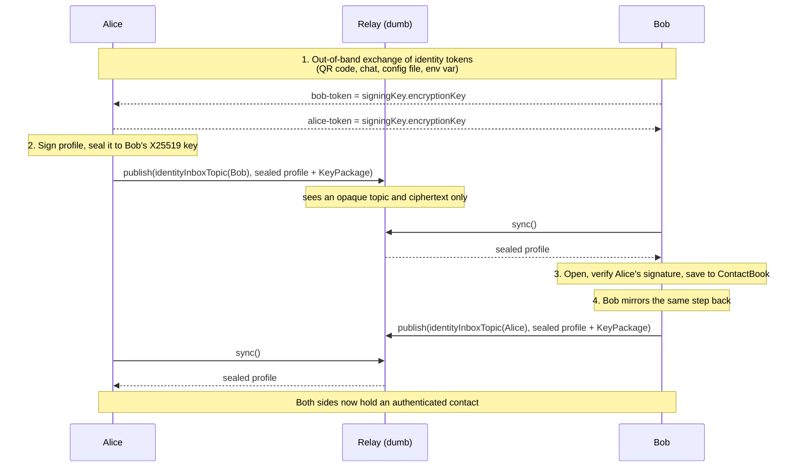
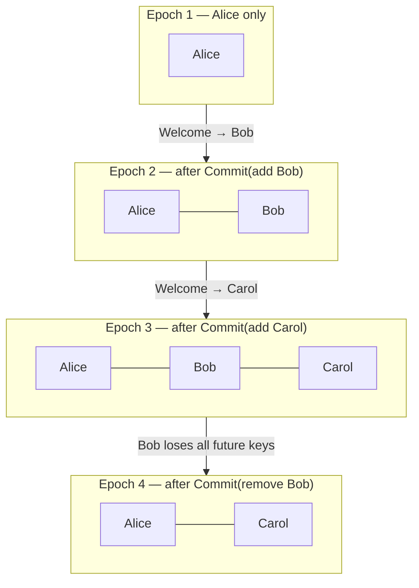
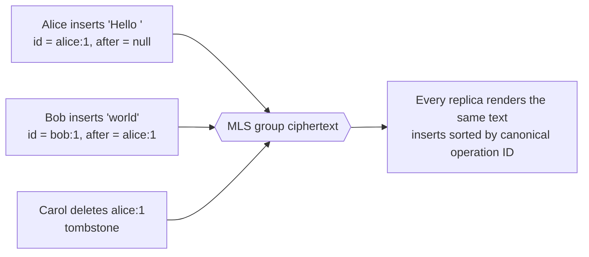

# Murmur

End-to-end encrypted messaging over deliberately dumb relays.

Murmur ships as one public library, [`@slopus/murmur`](packages/murmur-core),
for browsers and Node.js. It provides identities, contact profiles, private
messages, encrypted files, durable delivery, MLS groups, and convergent shared
text documents. Applications decide what messages mean and supply their own
durable storage.

```text
application
    |
@slopus/murmur
    |---- MurmurStore          durable state you own
    `---- RelayTransport[]     replaceable, untrusted
              |
          dumb relays
```

> Murmur is a `0.x` project. Its cryptographic implementation has not received
> an independent security audit, and its MLS support is a tested Murmur profile
> rather than a complete general-purpose implementation of RFC 9420.

## Contents

- [What you can build with it](#what-you-can-build-with-it)
- [Identities](#identities)
- [Adding each other as contacts](#adding-each-other-as-contacts)
- [Private messaging](#private-messaging)
- [Encrypted files](#encrypted-files)
- [Group messaging](#group-messaging)
- [Shared documents](#shared-documents)
- [Install and quick start](#install-and-quick-start)
- [Public API](#public-api)
- [Delivery model](#delivery-model)
- [CLI](#cli)
- [Run a local relay](#run-a-local-relay)
- [Repository](#repository)
- [Development](#development)

## What you can build with it

| Use case                         | What Murmur gives you                                                                                                     |
| -------------------------------- | ------------------------------------------------------------------------------------------------------------------------- |
| **Agent-to-agent messaging**     | Two coding agents on different machines exchange tasks and results. The relay never sees the plaintext of either side.    |
| **Human-in-the-loop control**    | A phone app talks to a long-running agent. The agent is offline for hours; the relay queues events until it acknowledges. |
| **Agent teams**                  | An MLS group of five agents plus one operator. Removing a compromised agent forward-secures every later epoch.            |
| **Encrypted artifact handoff**   | A build agent uploads a 40 MiB encrypted blob; only holders of the message descriptor can decrypt it.                     |
| **Collaborative editing**        | Multiple agents append to the same document concurrently, offline, and converge without a server merge.                   |
| **Self-hosted or embedded chat** | Swap `HttpRelayTransport` for LAN, WebRTC, or Bluetooth by implementing one interface.                                    |

Two properties drive the design:

1. **The relay is dumb and untrusted.** It authenticates envelopes, fans them
   out, queues them until acknowledged, and stores content-addressed ciphertext.
   It cannot decrypt profiles, messages, files, group traffic, or documents.
2. **The application owns durability.** Nothing is auto-acknowledged. You commit
   your state first, then acknowledge. A crash re-delivers, never loses.

## Identities

A Murmur identity is **two independent key pairs**, not one:

```text
IdentityKeyPair
├── signing key      Ed25519    who signed this?      → identityId, inbox topic
└── encryption key   X25519     who can open this?    → sealed boxes
```

```typescript
import { generateIdentityKeyPair, identityId, identityInboxTopic } from "@slopus/murmur";

const alice = generateIdentityKeyPair();

identityId(alice); // "8Fj2...": base64url of the public signing key
identityInboxTopic(alice); // "identity:...": hash-derived relay topic
```

- There is no account, no username, and no server-side registry. An identity is
  valid the moment it is generated.
- The **identity token** is the pair of public keys, joined with a dot:
  `<signingKey>.<encryptionKey>`. This is what you paste, scan, or exchange out
  of band. It carries no secrets.
- The **inbox topic** is derived by hashing the public signing key, so the relay
  routes to it without being told who you are in the clear.
- Secrets are always `Uint8Array`. Call `destroyIdentity(identity)` when done;
  base64url exists only at wire boundaries.

## Adding each other as contacts

Murmur has no friend graph on the server. Adding a contact means: _learn the
other side's public keys out of band, then send them a signed profile encrypted
to those keys._ The relay only ever sees a ciphertext addressed to an opaque
topic.



Why it is two-directional: receiving a profile proves the _sender's_ identity to
you, not yours to them. Each side publishes once.

With the CLI:

```bash
# On each machine
murmur --relay http://127.0.0.1:8787 sign-in --first-name Alice
murmur me                       # prints your identity token

# Paste the other side's token
murmur contacts add <identity-token>
murmur sync
murmur contacts
```

With the library:

```typescript
import {
    ContactBook,
    decryptContactProfile,
    encryptProfileForContact,
    identityInboxTopic,
} from "@slopus/murmur";

// Alice → Bob
const sealed = encryptProfileForContact(alice, bobPublicKeys, {
    name: "Alice",
    metadata: { role: "agent" },
});

// `sealed` is a plain JSON-safe envelope; the application picks its wire encoding.
await murmur.publish(identityInboxTopic(bobPublicKeys), utf8Encode(JSON.stringify(sealed)), [
    bobPublicKeys,
]);

// Bob, on receipt
const opened = decryptContactProfile(bob, sealed); // throws on a bad signature
const contacts = new ContactBook(bob, store);
await contacts.save(opened);
```

`decryptContactProfile` verifies that the profile was signed by the claimed
sender **and** that it was addressed to this specific recipient, so a profile
cannot be replayed at a third party. The CLI additionally attaches a one-use MLS
KeyPackage to the same envelope, which is what later makes a group invite
possible without a new round trip.

## Private messaging

A direct message is signed by the sender, sealed to the recipient's X25519 key
with an ephemeral key pair, and published to the recipient's topic.

```text
  plaintext message ──► sign (Ed25519) ──► seal (X25519 + ChaCha20-Poly1305)
                                                      │
                                                      ▼
    relay sees:  topic  |  recipient hint  |  ciphertext  |  size  |  time
                                                      │
                                                      ▼
  open + verify signature ──► accept exactly once ──► your database ──► ack
```

```typescript
import {
    acceptPrivateMessageFromContact,
    createPrivateMessage,
    encryptPrivateMessageForContact,
} from "@slopus/murmur";

// Send
const message = createPrivateMessage("deploy finished");
const envelope = encryptPrivateMessageForContact(alice, bobPublicKeys, message);
await murmur.publish(
    identityInboxTopic(bobPublicKeys), // or any application-chosen conversation topic
    encodeEncryptedPrivateMessage(envelope),
    [bobPublicKeys],
);

// Receive, exactly once
const accepted = await acceptPrivateMessageFromContact(
    store,
    bob,
    envelope,
    async (transaction, opened) => {
        await transaction.set(`chat/${opened.message.id}`, encodeRecord(opened));
    },
);
accepted.status; // "opened" on first sight, "duplicate" on replay
await received.acknowledge(); // only now is the relay allowed to forget it
```

`acceptPrivateMessageFromContact` writes your application record and the replay
marker inside one `MurmurStore` transaction. A re-delivery after a crash is
reported as `"duplicate"` instead of being applied twice. A reused message ID
carrying _different_ signed content throws `DirectMessageIdCollisionError` and
stays unacknowledged for operator handling.

Limits: 64 attachments and 64 MiB of aggregate plaintext attachment data per
message.

## Encrypted files

Files never reach a relay in plaintext. Each file gets a fresh AES-GCM key, and
the ciphertext is stored content-addressed. The message carries the descriptor,
so possession of the blob alone is useless.

```text
file bytes ──► encryptFile ──► { descriptor, blob }
                                    │        │
              key + nonce + name ───┘        └─── ciphertext → putBlob(), addressed by hash
                    │
                    └──► travels inside the encrypted private message
```

```typescript
const attachment = encryptFile(fileBytes, {
    name: "report.pdf",
    mediaType: "application/pdf",
});
await murmur.putBlob(attachment.blob.bytes);

const message = createPrivateMessage("Attached", [attachment.descriptor]);
// ... send as above

// Receiver
const blob = await murmur.getBlob(descriptor.blobId);
const plaintext = decryptFile(descriptor, blob); // verifies hash, size, and metadata
```

## Group messaging

Groups use MLS (RFC 9420 subset): a TreeKEM ratchet tree with forward-secret
epochs. Every membership change is a Commit that advances the epoch, so a
removed member cannot read anything sent afterwards.



Every member of every epoch publishes to **one stable, opaque topic** derived
from the group ID. The relay sees identical ciphertext for chat, membership
changes, and document edits.

```text
mlsGroupTopic(groupId) = "mls:" + base64url(hash(groupId))

   Alice ─┐
   Bob   ─┼──► one topic ──► relay ──► queue per member ──► ack per member
   Carol ─┘
```

```typescript
import { MlsGroupChannel, createMlsGroup } from "@slopus/murmur/mls";

const channel = new MlsGroupChannel(createMlsGroup(alice));
await channel.subscribe(murmur);

// Send: prepare → persist → publish. Never publish before the checkpoint lands.
const prepared = channel.prepareSend(utf8Encode("hello team"));
await store.transaction(async (transaction) => {
    await transaction.set(groupStateKey, prepared.serializeEpoch());
    await transaction.set(outboxKey, prepared.payload);
});
prepared.markPersisted();
await prepared.publish(murmur);

// Receive
for (const received of await murmur.sync()) {
    const delivery = channel.handle(received);
    if (delivery?.status === "opened") {
        // persist delivery.serializeEpoch() with your record, then:
        delivery.markPersisted();
        await delivery.acknowledge();
    }
}
```

The `prepare → persist → publish` shape is deliberate. A restart can never
publish a Commit whose next-epoch private state was not durably written first,
which is the failure that otherwise locks a member out of their own group.

Membership changes go through `prepareCommit`, which returns the Commit payload
plus a `welcome` blob for newly added members, and the staged next epoch that
you adopt only after both are durably recorded.

With the CLI:

```bash
murmur groups create --name "Protocol team"
murmur groups invite --group <group-id> --contact <identity-id>
murmur sync
murmur groups send --group <group-id> --message "hello"
murmur groups messages --group <group-id>
murmur groups remove --group <group-id> --contact <identity-id>
```

## Shared documents

A shared document is an operation-based replicated text object (a CRDT) carried
inside ordinary MLS application messages. Relays see the same opaque group
ciphertext as chat, and there is no server-side merge.



```typescript
import {
    SharedTextDocument,
    createDocumentInsert,
    createDocumentOperationId,
} from "@slopus/murmur";

const document = new SharedTextDocument();
const insert = createDocumentInsert(createDocumentOperationId(actorId, 1), null, "hello");

document.apply(insert, actorId); // actorId must be the authenticated MLS leaf
document.render(); // "hello"
document.operations(); // stable log for persistence or catch-up
```

Properties that matter in practice:

- Operations are **idempotent and commutative**, so any delivery order, any
  number of re-deliveries, and long offline periods converge.
- Deletes are permanent tombstones and may arrive **before** their target.
- Concurrent inserts at the same anchor are ordered by canonical operation ID,
  identically on every replica.
- Every mutation's actor is bound to the authenticated MLS leaf, so a member
  cannot forge an edit attributed to someone else.
- Bounded by design: 10 000 operations and 4 MiB of retained state per document.

With the CLI:

```bash
murmur documents create --group <group-id> --name "Draft"
murmur documents insert --document <document-id> --text "hello"
murmur documents
murmur documents delete --document <document-id> --target <actor>:<sequence>
```

## Install and quick start

```bash
pnpm add @slopus/murmur
```

The package is ESM-only, side-effect free, and includes TypeScript declarations
and source maps. It has no Node.js imports and supports Node.js 20 or later and
modern browsers.

```typescript
import {
    HttpRelayTransport,
    MemoryMurmurStore,
    MurmurClient,
    generateIdentityKeyPair,
    identityInboxTopic,
    utf8Decode,
} from "@slopus/murmur";

const identity = generateIdentityKeyPair();
const store = new MemoryMurmurStore();
const relay = new HttpRelayTransport("primary", "https://relay.example");
const murmur = new MurmurClient({
    identity,
    store,
    transports: [relay],
});

await murmur.subscribe(identityInboxTopic(identity));

for await (const received of murmur.events()) {
    console.log(utf8Decode(received.event.payload));

    // Acknowledge only after application state is durably committed.
    await received.acknowledge();
}
```

`MemoryMurmurStore` is intended for examples and tests. Production applications
should implement `MurmurStore` with IndexedDB, SQLite, or another transactional
store.

## Public API

Everything below belongs to the same `@slopus/murmur` npm package:

| Import                     | Main API                                                                              |
| -------------------------- | ------------------------------------------------------------------------------------- |
| `@slopus/murmur`           | complete common API                                                                   |
| `@slopus/murmur/client`    | `MurmurClient`, delivery, acknowledgement, retry, and blob operations                 |
| `@slopus/murmur/crypto`    | identity keys, signing, verification, sealed boxes, hashing, and secret destruction   |
| `@slopus/murmur/identity`  | identity serialization, inbox topics, encrypted profiles, and `ContactBook`           |
| `@slopus/murmur/messaging` | direct messages, durable replay acceptance, encrypted files, codecs, and limits       |
| `@slopus/murmur/mls`       | groups, epochs, KeyPackages, Commits, Welcome, TreeKEM, and private messages          |
| `@slopus/murmur/transport` | `RelayTransport`, `HttpRelayTransport`, signed events, queues, blobs, and wire codecs |
| `@slopus/murmur/storage`   | `MurmurStore`, `StoreTransaction`, and `MemoryMurmurStore`                            |
| `@slopus/murmur/document`  | `SharedTextDocument` and convergent insert/delete operations                          |
| `@slopus/murmur/utils`     | strict base64url, UTF-8, canonical JSON, byte comparison, copying, and zeroing        |

The main client surface is:

```typescript
new MurmurClient({
    identity: IdentityKeyPair,
    store: MurmurStore,
    transports: readonly RelayTransport[],
    outboundHistoryLimit?: number,
});

client.subscribe(topic): Promise<void>;
client.publish(topic, payload, recipients?): Promise<PublishResult>;
client.publishEvent(event): Promise<PublishResult>;
client.retryOutbound(): Promise<readonly PublishResult[]>;
client.retryOutboundSettled(): Promise<RetryOutboundReport>;
client.sync(waitMilliseconds?, signal?): Promise<readonly ReceivedEvent[]>;
client.events(signal?, waitMilliseconds?): AsyncIterable<ReceivedEvent>;
client.putBlob(ciphertext): Promise<RelayBlob>;
client.getBlob(id): Promise<RelayBlob | undefined>;
```

See the [library API guide](packages/murmur-core/README.md) for identity,
messaging, storage, and transport examples. The MLS implementation and its
supported RFC subset are described in
[MLS internals](packages/murmur-mls/README.md).

## Delivery model

```text
publish ──► transport A  accepted ─┐
       └──► transport B  failed    ├──► success (≥1 accepted), remainder retried later
                                   ┘

sync    ──► copies from A and B ──► authenticate ──► order ──► deduplicate
                                                                 │
                                            commit your state ───┤
                                                                 └──► acknowledge()
```

Publishing succeeds after at least one configured transport accepts an event.
Murmur remembers which transports accepted it so later retries can resume the
remaining publications.

Incoming copies from multiple relays are authenticated, merged, ordered, and
deduplicated. Delivery to application code is acknowledged by hand. An
application should commit its own state first, then call
`received.acknowledge()`. Unacknowledged events are delivered again after a
restart.

The relay cannot decrypt profiles, messages, files, group traffic, or shared
documents. It does observe routing identifiers, timing, and ciphertext sizes.

## CLI

The `murmur-chat` package exposes the same system to people and agents from a
Node.js command line:

```bash
pnpm add --global murmur-chat

murmur --relay http://127.0.0.1:8787 sign-in --first-name Alice
murmur me
murmur contacts add <identity-token>
murmur send --to <identity-id> --message "hello"
murmur sync
```

All command results are JSON except `help`, which makes the CLI usable directly
as an agent tool. See the [CLI guide](packages/murmur-cli/README.md).

## Run a local relay

The default Node relay uses SQLite and exposes the browser-safe HTTP transport:

```bash
pnpm --filter @murmur/relay-node build
PORT=8787 node packages/murmur-relay-node/dist/server/main.js
```

Relay state defaults to `./data/murmur-relay.sqlite`. Set
`MURMUR_RELAY_DB`, `MURMUR_RELAY_ORIGINS`, `HOST`, or `PORT` to override the
defaults.

The relay only authenticates envelopes, fans events out to subscribers or
explicit recipients, retains delivery queues until acknowledgement, and stores
content-addressed ciphertext blobs.

## Repository

```text
master-plans/                user-directed product intent
packages/
  murmur-core/               the public @slopus/murmur package
  murmur-mls/                private MLS implementation bundled into the library
  murmur-relay/              runtime-neutral dumb relay
  murmur-relay-node/         SQLite and HTTP relay host
  murmur-cli/                Node.js CLI
  murmur-server/             historical pre-relay server retained during migration
```

The [product vision](master-plans/01-vision.md) and
[code organization rules](master-plans/02-code-organization.md) are the source
of truth. Historical code and documents do not override them.

## Development

This is a pnpm workspace. Node.js 22.5 or later is required for the full
workspace because the CLI and Node relay use `node:sqlite`.

```bash
pnpm install
pnpm test
pnpm typecheck
pnpm build
pnpm lint
pnpm format:check
```

Before committing:

```bash
pnpm format
```

To inspect the exact npm artifact:

```bash
pnpm --filter @slopus/murmur pack
```

## License

[MIT](packages/murmur-core/LICENSE)
